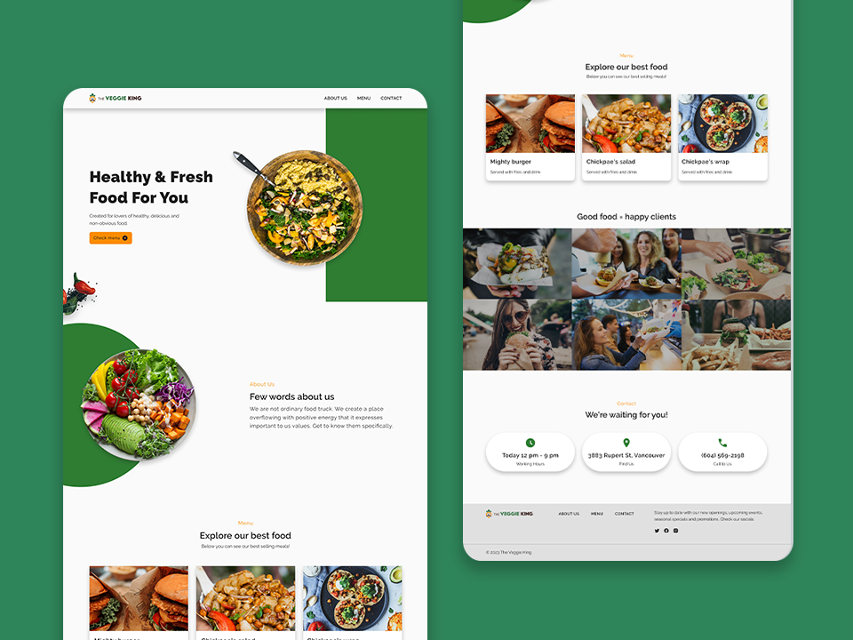
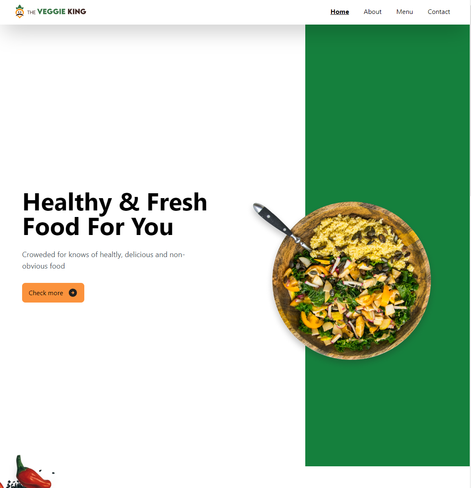
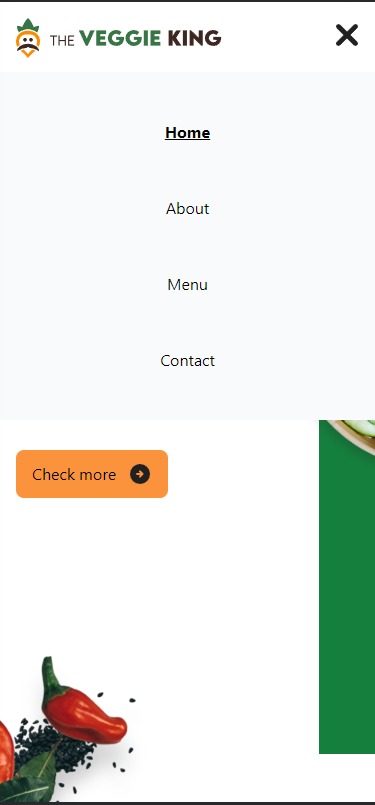
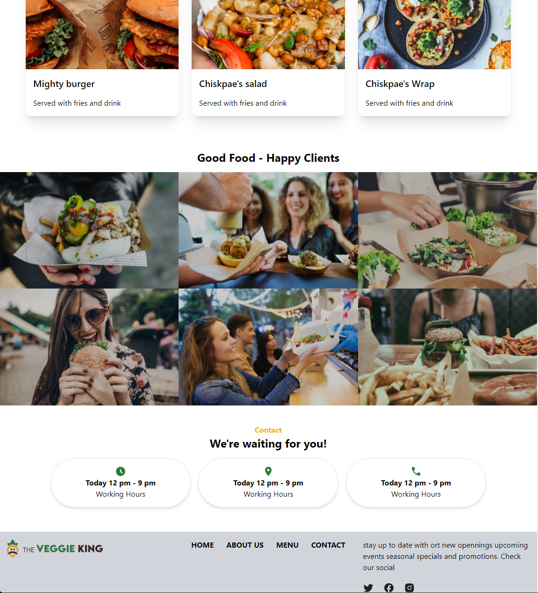

  

 

**Prueva de BigDevSoon [The Veggie King](https://app.bigdevsoon.me/projects/the-veggie-king)**

## Autores

- Henry  [@Hhenry](https://github.com/hhenry14)
- BigDevSoon [@frontendMentor](https://app.bigdevsoon.m)

## Lenguajes

* HTML
* Tailwind CSS
* JavaScript
* React

<!-- ALL-CONTRIBUTORS-LIST:END -->
## Imagen

<table>
<tr align="center">
<td align="center">

</td>
<td align="center">

</td>
</tr>
<tr>
<td align="center">

</td>
<td align="center">

</td>
</tr>

</table>

